# Mandatory Assignment 1: Task-based Parallel Computing in Java

> Group 7:
> 02158 Concurrent Programming

> Technical University of Denmark -
> 25/09/2024

**Members:**

| Study nr. | Name                       |
|-----------|----------------------------|
| s215773   | Magnus August McCubbin     |
| s224792   | Javad Asgari Shafique      | 
| s224772   | Hjalte Cornelius Nannestad |

For this assigment we've decided to include the 3 recommend files as test cases,
in this report we'll refer to them by their name as seen in the following table
together with the pattern we've used for the search.

| File name   | Description                           |
|-------------|---------------------------------------|
| 02hgp10.txt | Human Genome Project                  |
| 100-0.txt   | Complete works of William Shakespeare |
| xtest.txt   | Text from problem 2                   |

Primarily the tests were run on a Ryzen 9 5900HX 8/16 3.3 GHz (4.6 GHz) laptop processor on Linux 6.11.

For plots, we decided to go with gnuplot to automate the process of generating plots.
See the attached GitHub repository for the scripts used to generate the
plots: <https://github.com/cjavad/dtu-02158-concurrent-programming>.

## Problem 1

Attempting to find a pattern that took a significant amount of time (greater than 0.1 seconds) using a combination
of the data files we used was not feasible without using patterns that yielded no results, but we decided on a pattern
with a small amount of results anyway. We decided to use 50 runs, this will give us better measurements of the average
speedup
and other average values later on.

| Parameter | Value       |
|-----------|-------------|
| PATTERN   | TCAGGGG     |
| FILE      | 02hgp10.txt |
| RUNS      | 50          |
| WARMUPS   | 0           |
| EXECUTOR  | Single      |

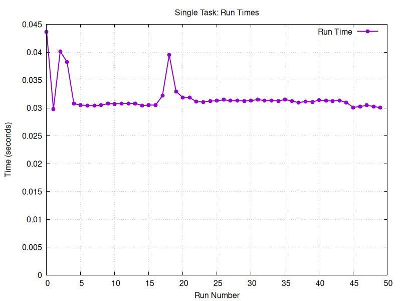

Running the search with no warmups shows a small startup cost that nearly doubles the time it took to search for the
pattern
in a single go. This can be attributed to many factors, including the startup cost of Java, memory allocation and other
factors.

| Parameter | Value       |
|-----------|-------------|
| PATTERN   | TCAGGGG     |
| FILE      | 02hgp10.txt |
| RUNS      | 50          |
| WARMUPS   | 25          |
| EXECUTOR  | Single      |

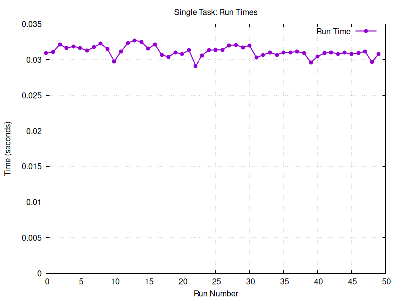

Using a warmup parameter of 25, the variance has been smoothed out to less than 0.01 seconds.

We had additionally performed tests on combinations of 10 runs with 2 and 4 warmups and 2, 4 and 8 warmups with 50
runs but found this combination made the most sense for accurate results.

## Problem 2

We want to split up the problem into smaller sub-problems that can be evaluated
concurrently. To do this we split up the input range into `n` equally sized sub
ranges, where `n` is the number of tasks. Each range overlaps the start of the
next by exactly `p - 1` characters where `p` is the length of the pattern. If
not for this overlap, the last `p - 1` possible occurences pattern in each
range would be ignored.

The number of occurences of `xxxx` found in `xtest.txt` is 2605 for all number
of tasts in the range of `0..16` as expected.

The following is the associated code.

```
// Create list of tasks
List<SearchTask> taskList = new ArrayList<SearchTask>();

for (int i = 0; i < ntasks; i++) {
    int from = i * len / ntasks;
    int to = (i + 1) * len / ntasks;
    int realTo = Math.min(to + pattern.length - 1, len);
    taskList.add(new SearchTask(text, pattern, from, realTo));
}
```

```
// Overall result is an ordered list of unique occurrence positions
result = new LinkedList<Integer>();
for (var future : futures)
        result.addAll(future.get()); 
```

We should expect the average runtime to scale linearly with the number of tasks
but cap out at the number of physical cores on the system. This is generally
what we see, however the speedup is not exactly one to one like expected. This
is likely explained by the fact that runtimes are so short that the actual work
doesn't dominate the runtime, and that the overhead incurred by spawning a task
weighs against the speedup.

| Parameter | Value      |
|-----------|------------|
| PATTERN   | xxxx       |
| FILE      | xtest.txt  |
| TASKS     | 0 (Single) |
| RUNS      | 50         |
| WARMUPS   | 25         |
| EXECUTOR  | Single     |

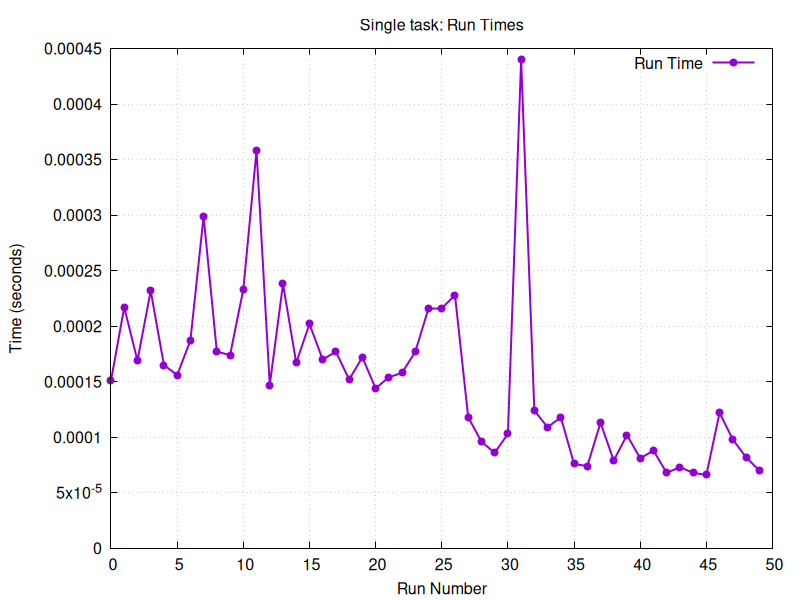

| Parameter | Value     |
|-----------|-----------|
| PATTERN   | xxxx      |
| FILE      | xtest.txt |
| TASKS     | 1         |
| RUNS      | 50        |
| WARMUPS   | 25        |
| EXECUTOR  | Single    |

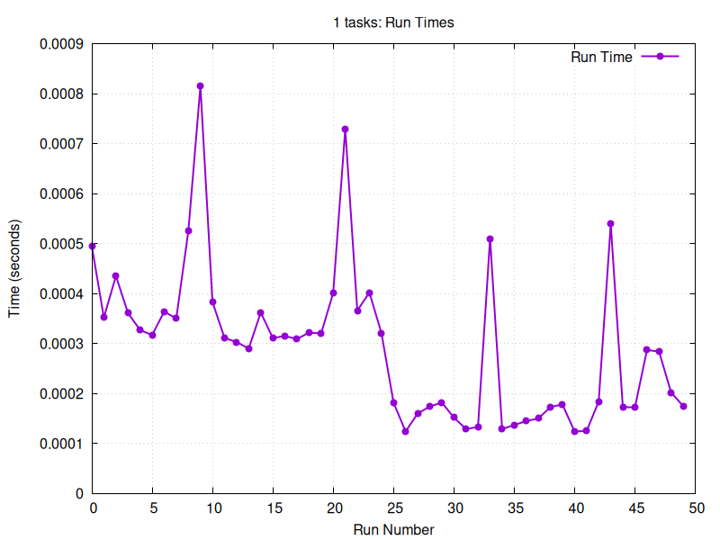

| Parameter | Value     |
|-----------|-----------|
| PATTERN   | xxxx      |
| FILE      | xtest.txt |
| TASKS     | 2         |
| RUNS      | 50        |
| WARMUPS   | 25        |
| EXECUTOR  | Single    |

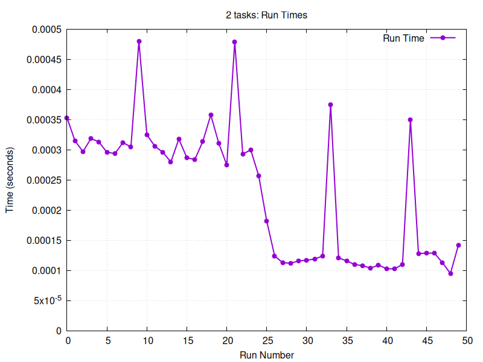

| Parameter | Value     |
|-----------|-----------|
| PATTERN   | xxxx      |
| FILE      | xtest.txt |
| TASKS     | 16        |
| RUNS      | 50        |
| WARMUPS   | 25        |
| EXECUTOR  | Single    |

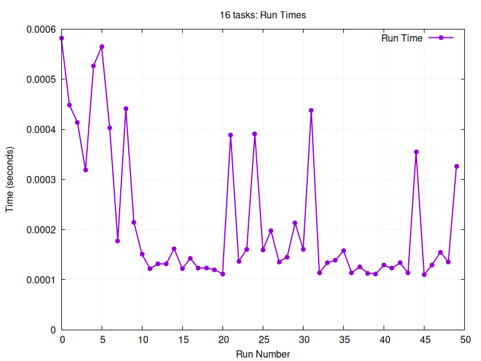

## Problem 3

Previously we had only had the ability to take advantage of a single OS thread
using the "Cached" executor each task now has its own thread to run on.
Since we are running on a machine with 8 physical cores and 16 logical cores (amount of different stack contexts the CPU
can keep track of at once) simple math might dictate we should expect a speedup of at least 8x.

| Parameter | Value     |
|-----------|-----------|
| PATTERN   | world     |
| FILE      | 100-0.txt |
| TASKS     | 1         |
| RUNS      | 50        |
| WARMUPS   | 25        |
| EXECUTOR  | Cached    |

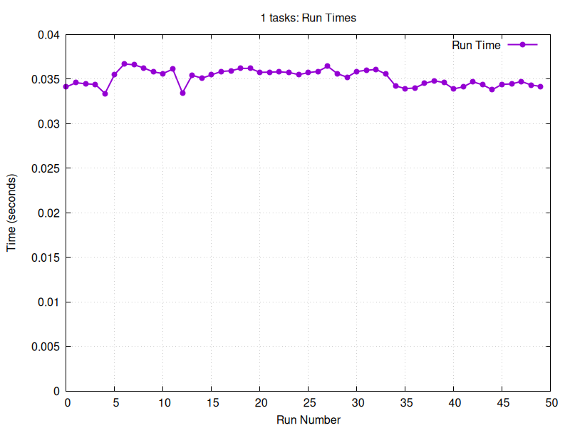

| Parameter | Value     |
|-----------|-----------|
| PATTERN   | world     |
| FILE      | 100-0.txt |
| TASKS     | 2         |
| RUNS      | 50        |
| WARMUPS   | 25        |
| EXECUTOR  | Cached    |

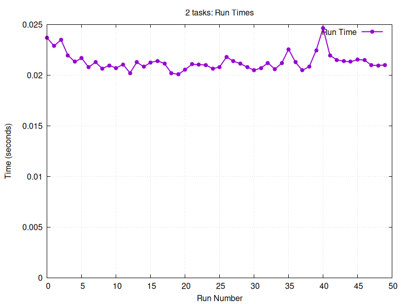

Comparing the speedup of 1 task vs 2 tasks we see an approximate speedup of 1.5x,
this is a bit less than the expected 2x speedup so how come?

Beyond the fact that the actual implementation of the Java code might have some overhead and non-paralellizable parts
the actual thread we are running does not always get 100% of the CPU time, and even more often the hungrier a thread the
less CPU time the OS scheduler will give it.

| Parameter | Value     |
|-----------|-----------|
| PATTERN   | world     |
| FILE      | 100-0.txt |
| TASKS     | 4         |
| RUNS      | 50        |
| WARMUPS   | 25        |
| EXECUTOR  | Cached    |

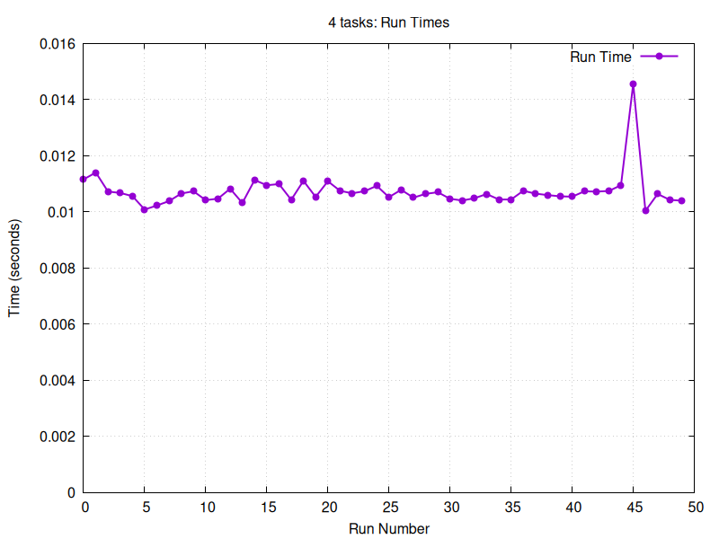

Doubling the amount of tasks (and threads) it does seem that we are getting a similar "doubling" in speedup, going from
the original 1.5x speed to near 3x.

| Parameter | Value     |
|-----------|-----------|
| PATTERN   | world     |
| FILE      | 100-0.txt |
| TASKS     | 16        |
| RUNS      | 50        |
| WARMUPS   | 25        |
| EXECUTOR  | Cached    |

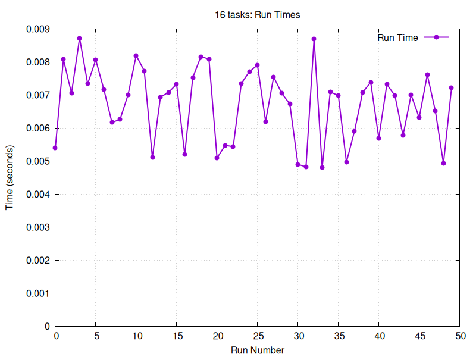

Now using the same amount of threads as the CPU has logical processing units, we see even in the best runs
the speedup was "only" double that of the 4 task/thread run, going on 0.01 seconds to half of that with 0.005 seconds.
This does seem to reflect the fact the CPU only has 8 physical cores, which is the actual representation of the amount
of physical
components it has to perform operations such as comparisons and memory access. If we consider the worst runs with 1
thread and the best runs with 16 threads the maximum point to point speedup is only 8x.

Going beyond this amount of tasks/threads the average speedup plateaus at around a total of 5x and even decreases at
some points
due to the nondeterministic nature of the operating system scheduler.

## Problem 4

Using a fixed thread pool executor, which in theory should reduce a lot of the overhead that comes
from creating and starting a new thread we can visualize the total average speedup in relation to the amount of tasks
(to overwork the threads to achieve maximum throughput) in proportion to the amount of threads which can reflect the
systems overall capability.

| Parameter | Value            |
|-----------|------------------|
| PATTERN   | world            |
| FILE      | 100-0.txt        |
| TASKS     | 1,2,4,8,16,32,64 |
| THREADS   | 1,2,4,8,16       |
| RUNS      | 50               |
| WARMUPS   | 25               |
| EXECUTOR  | Fixed            |


Executions that only have 1 thread seems to approximate an average speedup of 1x, which is expected.
The same actually goes for 2 threads, and even 4 threads where the average speedup is linearly increasing
with some relative factor of 1.5x perhaps due to the nature of the operating system, shared physical hardware and other
nondeterministic factors.

Once we reach 8 and 16 threads things seem to stop increasing, but with more tasks than threads it does seem that
throughput keeps on going up. This is likely happening since with more work to do, the less "starved" the threads are,
so they'll be able to perform work as soon as they are allowed to.

## Problem 5

Run on 24 core, 48 hyper-thread HPC node.

| Parameter | Value                    |
|-----------|--------------------------|
| PATTERN   | world                    |
| FILE      | 100-0.txt                |
| TASKS     | 1,2,4,8,16,32,64,128,256 |
| THREADS   | 1,2,4,8,16,32,64         |
| RUNS      | 50                       |
| WARMUPS   | 25                       |
| EXECUTOR  | Fixed                    |

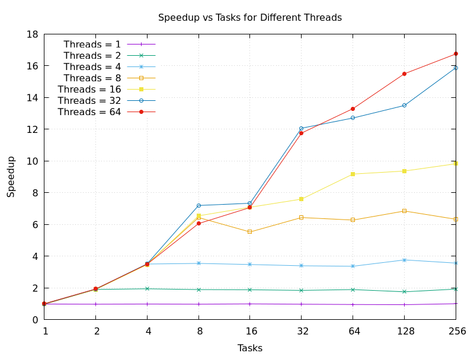

Running the program with the same number of threads as tasks showed a continuing increase in performance
when the task/thread count increased above the previous point where performance stopped increasing on the
laptop CPU. This was expected and follows the same pattern previously seen, where the performance
continues to increase as long as the CPU has enough hyper-threads.

Varying the number of tasks with the number of threads however leads to different results that aren't really seen
that well in problem 4. It follows the same trend where the speedup increases based off of the minimum
between the tasks and threads. Where it differs (or more correctly is much more visible in the data)
is with 16 threads or greater, where when the number of tasks increases above the number of threads,
the performance continues to increase significantly. This could be because there are some threads that
get postponed by the OS scheduler and take longer to finish or some data inputs for tasks taking longer to
process than others, and splitting the data up into more tasks allows it to be better distributed based off
of which threads are currently running, allowing it to better adapt to the real world execution conditions of the
program.

## Conclusion

The program we have measured and modeled on for this occasion is somewhat close to a 100% CPU busy program
which means how fast it is really depends on the amount of CPU there is available.

Using Java standard library features such as Threads and Futures we can express the given work load in a way that can be
performed independently of each other, allowing primarily Java and our operating system to run more of our code at once.

But as we've seen it does not nearly translate to running all of our code on all the theoretically available resources
at
once. Java is not capable of making pure CPU tasks concurrent on a single operating system thread,
simply giving the single executor more work to do does not translate into the work being completed faster.

Adding threads into the mix allows the operating system to schedule our code to run on the multiple cores many system
have available to them, but even then CPUs can have less than advertised limits as hyper-threads share physical
hardware components that the CPU schedules and manages for us.

In general splitting our task up into parallel chunks allowed it to use more of the physical resources at once but not
quite beyond that. It also seems that giving the CPU / OS more work to do lead to more work being done, although we
cannot conclude this will continue indefinitely. Having more tasks than threads seemed to give the best performance by 
distributing work based on which threads were currently running and had no work to do.