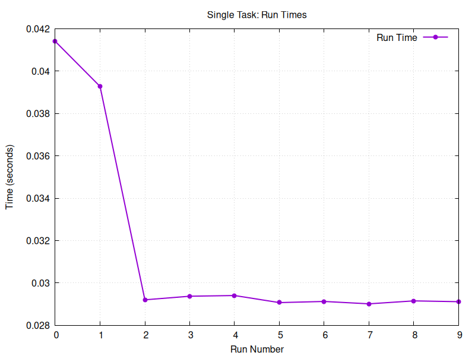

# Mandatory Assignment 1: Task-based Parallel Computing in Java

> Group 7:
> 02158 Concurrent Programming

**Members:**

| Study nr. | Name                       |
|-----------|----------------------------|
| s215773   | Magnus August McCubbin     |
| s224792   | Javad Asgari Shafique      | 
| s224772   | Hjalte Cornelius Nannestad |

## Problem 1

Use `-W 2`

## Problem 2

## Problem 3

## Problem 4

## Problem 5