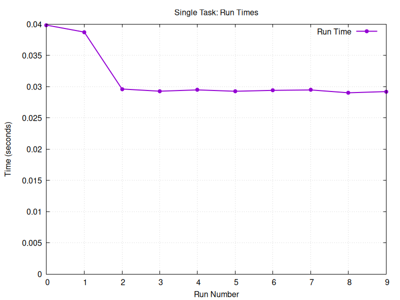
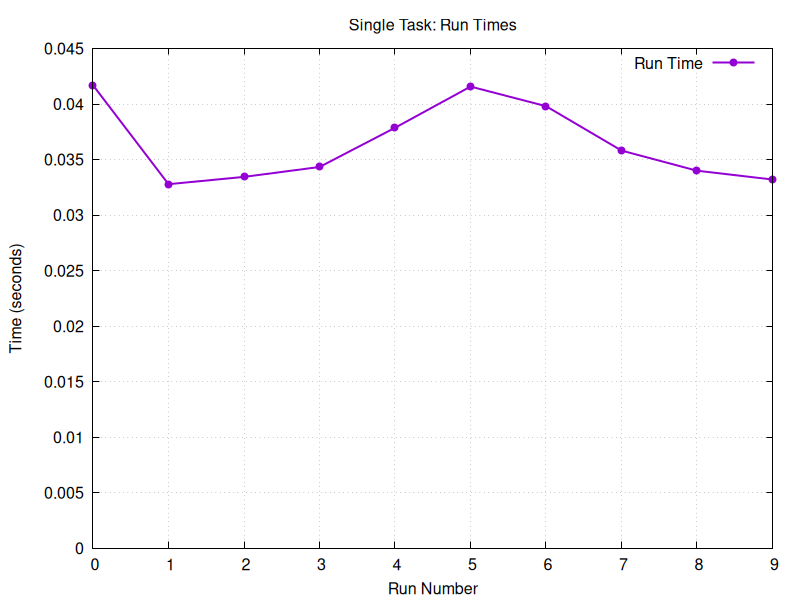
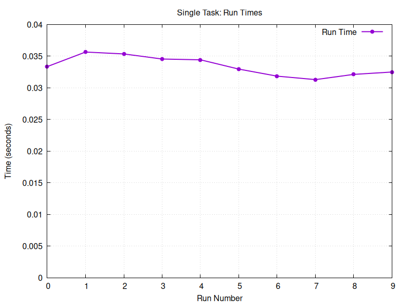
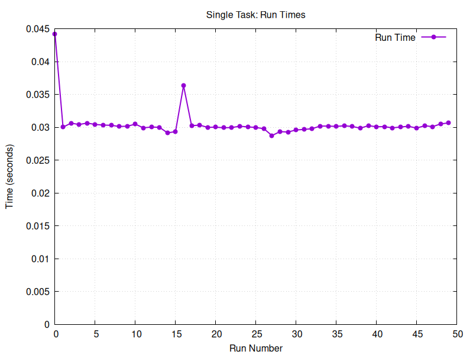
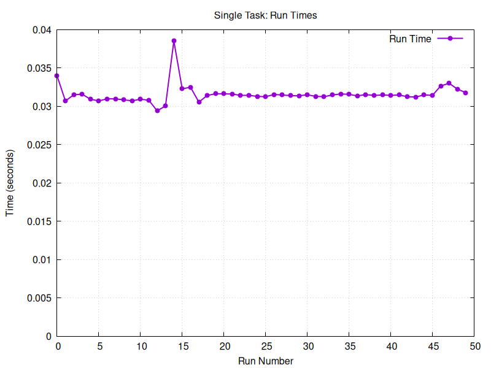

# Mandatory Assignment 1: Task-based Parallel Computing in Java

> Group 7:
> 02158 Concurrent Programming

**Members:**

| Study nr. | Name                       |
|-----------|----------------------------|
| s215773   | Magnus August McCubbin     |
| s224792   | Javad Asgari Shafique      | 
| s224772   | Hjalte Cornelius Nannestad |

## Problem 1

Parameters:

```
PATTERN=TCAG
FILE=./data/02hgp10.txt
```



Using `-W 2`



Using `-W 4`








## Problem 2

> TODO: Explain this

```java
// Create list of tasks
List<SearchTask> taskList = new ArrayList<SearchTask>();

for(
int i = 0;
i<ntasks;i++){
int from = i * len / ntasks;
int to = (i + 1) * len / ntasks;
int realTo = Math.min(to + pattern.length - 1, len);
    taskList.

add(new SearchTask(text, pattern, from, realTo));
        }
```

```java
// Overall result is an ordered list of unique occurrence positions
result =new LinkedList<Integer>();
        for(
var future :futures)result.

addAll(future.get()); 
```

> TODO: Speedup %

Parameters:

```
WARMUPS=25
RUNS=50

PATTERN=xxxx
TASKS=16
FILE=./data/xtest.txt
```


## Problem 3

Parameters:

```
PATTERN="world"
FILE=./data/100-0.txt
```

Hardware specs:

Mobile Ryzen 9 5900HX 8/16 3.3 GHz (4.6 GHz)


## Problem 4


## Problem 5

Ran on 48-core HPC node.

